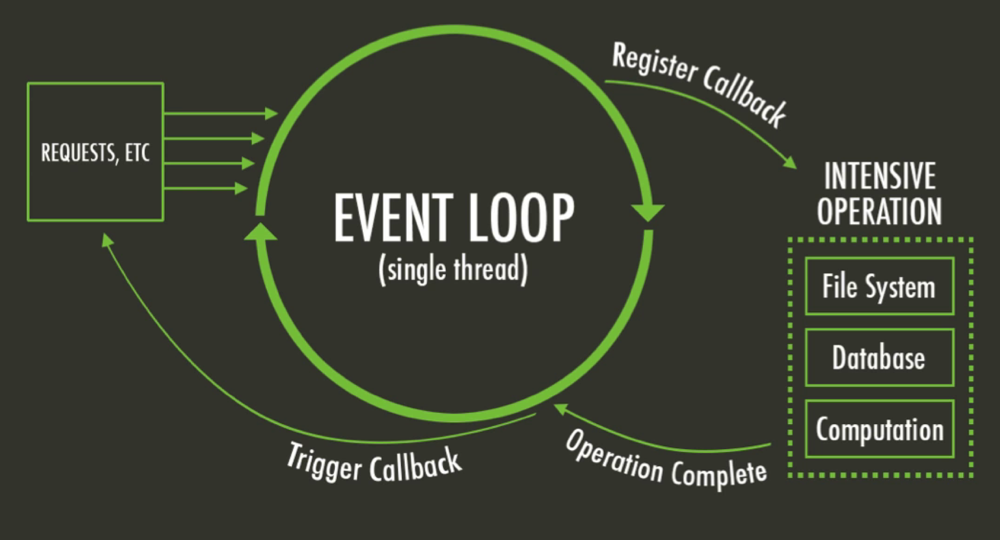
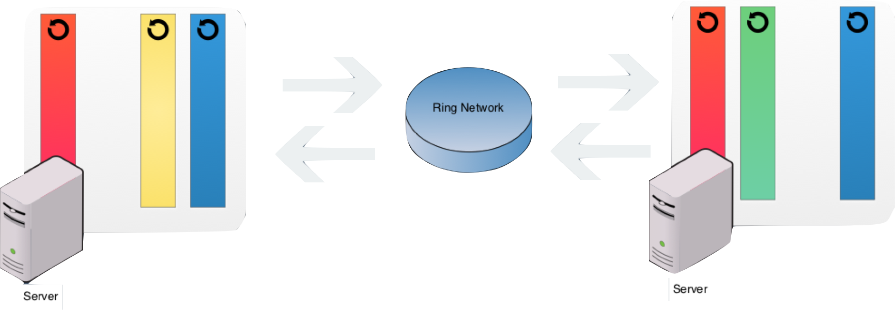
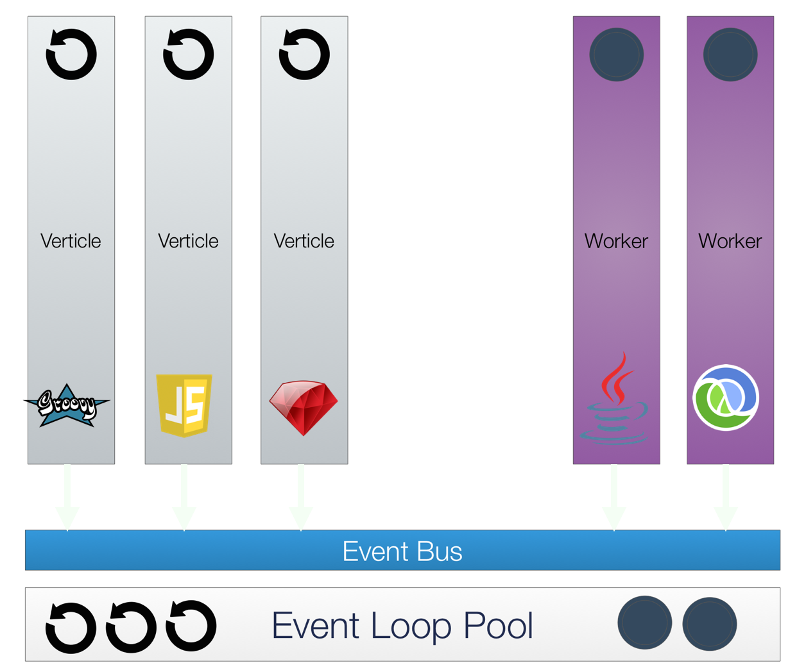

# Realtime Apps with
<!-- .slide: data-background="images/bg2.jpg" -->

## Hello

### I'm J. Juan R. Zuñiga

- I'm software developer in [MakingDevs](http://makingdevs.com/)
- I'm NOT a great software developer, I'm more like a Mentor
- Programming is my favorite job and hobbie
- Learn about many platforms is me current interest
- I really want to be a software professional
- You can find me as '_neodevelop_' almost on every social network (GitHub, Twitter, Quora, Delicious, etc.)

## Agenda

- What's Vert.x?
    - Why you should consider it?
- Main components
- Architecture of your apps
- Main concerns
- Q & A in any moment you wish

# What is Vert.x?

> Vert.x is a lightweight, high performance application platform for the JVM that's designed for modern mobile, web, and enterprise applications.

Well, this is true in Vert.x 2

# What is Vert.x now?

> Vert.x is a tool-kit for building reactive applications on the JVM.

## Inspired by NodeJS

- Server side Javascript
- Event Driven Non-Blocking IO
- Single thread / single event loop
- App register handler
- Event trigger the handler
- Everything runs inside the event loop

## Features

- Concurrency
    - Simple actor-like.
- Scalable
    - Is event driven and non blocking.
- Polyglot
    - Idiomatic APIs for every language that Vert.x supports
        - **Java**, **JavaScript**, **Groovy** and **Ruby**

## how it works?

## Reactor Pattern

- Vert.x uses a variation called "multi-reactor".
  - Scales easily.
- Issues
  - You must NOT block the event loop
  - Natural operations blocking the loop
    - Data access
    - Heavy calculation

## Why use Vert.x?

- General purpose and ver flexible.
  - Is simple for network utilities, modern webapps, HTTP/REST µ-services.
- There's not a _correct way_ to write an application.
- Lighweight; the core is around 650 kB.
- It's NOT an application server.
- It's modular.
- Simple withouth being simplistic. The API is _breaf_ and really easy to use.

# Main components

## Distributed application

## Demo time!

# Architecture of your apps

## Why you can do this?

- It’s build on top of [Netty](https://github.com/netty/netty)
- [Hazelcast](http://hazelcast.org/) for network discovery of nodes
- [Jackson](http://wiki.fasterxml.com/JacksonHome) for JSON expose
- Java 7+ for Vert.x 2
- Java 8+ for Vert.x 3
  - If you wish you can use [RxJava](https://github.com/ReactiveX/RxJava/wiki/How-To-Use-RxJava)

# Main Concerns

## About the languages

- Concern
  - Javascript - https://www.destroyallsoftware.com/talks/wat
- Resolution
  - Polyglot programmming

## About the scaling

- Concern
  - how do we scale?, when you deploy a JVM program is single thread
- Resolution
  - `Runtime.availableProcessors() == 4`
  - `vertx run Verticle -instances 4`
  - Verticles:
    - Are assigned to one event/loop
    - Always executed on assigned thread
    - Has own class loaders and cannot shared global state
    - Can write the code assuming single threading

## About the communication

- Concern
  - how can we communicate between components?
- Resolution
  - The event bus
  - Addressing: Is a simple string
  - Handler registration
    - Pub/Sub
    - P2P
  - Messages types: String, primitives, vertx.JsonObject, vertx.Buffer
  - Distributed Vert.x(Event Bus), even the browser([SockJS](https://github.com/sockjs/sockjs-client) Bridge)

## About the state

- Concern
  - How do we share state? It’s dangerous if it’s mutable!!!
- Resolution
  - Vert.X Shared State
    - SharedData object
      - java.util.concurrent.ConcurrentMap
      - java.util.Set<E>
    - Elements must be inmutable
    - Only available within instances, not in a cluster
  - Allowed values: String, primitives, byte[]

## About the Event Loop

- Concern
  - Single thread is single event loop, and all is in it; is dangerous block the event loop. What we can do with blocking work(e.g. JDBC)?
- Resolution
  - Worker Verticles
     - Not assigned to event loop thread and executes in the background thread pool
     - Not concurrently executed
     - Not able to use TCP servers
     - We only need the event bus, but less of them should be used.

## Demo time!

# You can continue in...

## Resources

- The project site http://vertx.io/
- The project sample of this talk https://github.com/makingdevs/VertXWorkshop
- MakingDevs Blog http://blog.makingdevs.com

# Thank you!!!
<!-- .slide: data-background="images/bg4.jpg" -->
<small>Bring to you by MakingDevs</small>

